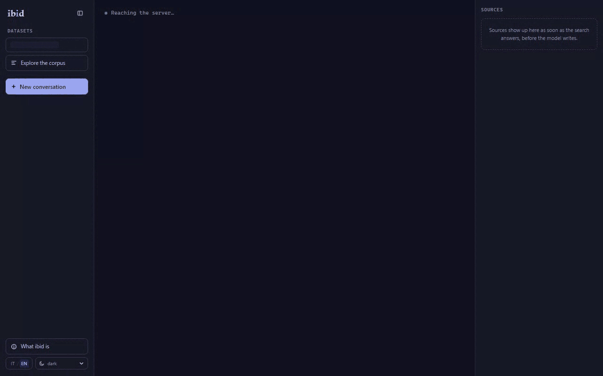
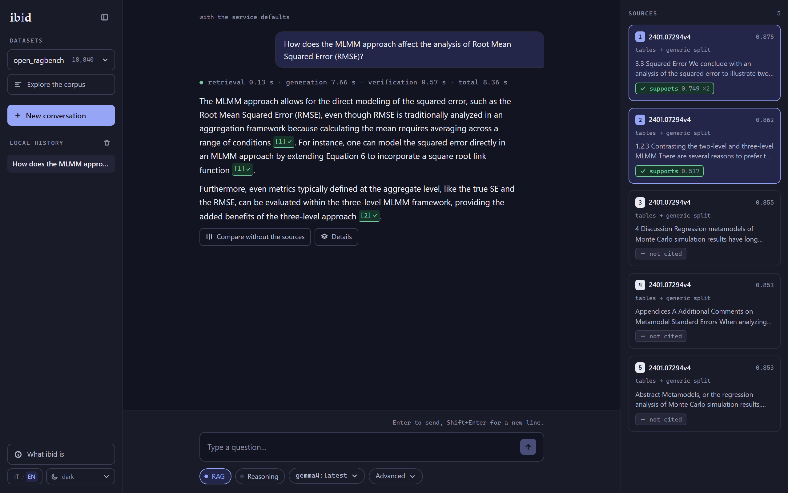
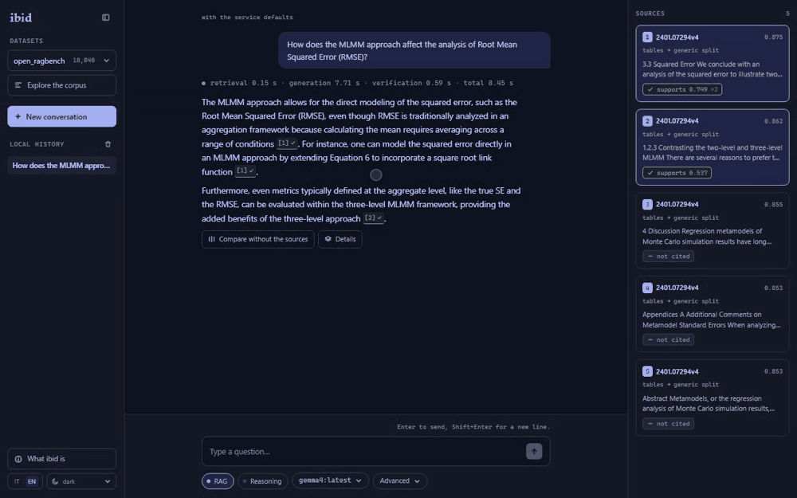

# ibid

**A testbed for RAG with sentence-level verified citations**, running small models locally and measured quantitatively on public datasets.

*[Versione italiana](README.md) 🇮🇹 (the primary one)*

Every claim the system produces carries a pointer to the chunk it came from, and that pointer is **verified**: an entailment model decides whether the cited text actually implies the sentence, instead of trusting whoever wrote it. The name is the abbreviation bibliographic notes use to refer back to the source just cited: from Latin *ibidem*, "in the same place".

This is not a demo with links at the bottom of the answer. It is a measurement bench, built around three claims: **two hold, one was refuted by the numbers**. The refuted one stayed on this page, with the table that disproves it: it is the most interesting finding in the project.



<sub>No cuts: the **eight seconds of waiting are the real ones**, and the timings row above the answer splits them into retrieval, generation and verification. The continuation, where the source opens at the cited chunk, is under «How it works»: same recording, cut in two.</sub>

---

## Getting started

Two commands, for two different needs. Confusing them is what makes a project hard to try.

### Seeing it work

You need **Docker**, and nothing else.

```bash
make demo                # docker compose --profile demo up
```

The interface is at `http://localhost:8000`. Inside is a **reduced index, committed to the repository**: 1,758 chunks cut out of the two real corpora, with the original vectors rather than recomputed ones. No corpus to download, no GPU: measured, **17.9 seconds** from the command to a page that answers.

It is there to **show, not to reproduce**, and the interface says so while it runs: the numbers on this page come from the full index, which is the section below. Generating answers also needs a model (`LLM_BASE_URL`, below); without one you can browse the corpus and retrieval still answers: only generation falls away.

### Touching the code, and redoing the measurements

You need **Docker** and an **OpenAI-compatible** endpoint with a model loaded: [Ollama](https://ollama.com) or llama.cpp's `llama-server` both work. The project never calls an inference engine directly: it always goes through `LLM_BASE_URL`, which is what makes it runnable on any machine.

```bash
# 1. the model, and the two knobs worth a 4x factor on prefill
ollama pull gemma4:latest
OLLAMA_CONTEXT_LENGTH=32768 OLLAMA_FLASH_ATTENTION=1 ollama serve

# 2. Qdrant and the backend
make up                  # docker compose --profile full up -d --build

# 3. the corpora (one-off: ~2 GPU hours for both)
make fetch-datasets
make ingest

# 4. the interface
make dev                 # backend + frontend, at http://localhost:5173
```

No address is hard-coded in `compose.yml`: moving Qdrant or the model to another machine is an environment variable, not a source change.

```bash
QDRANT_URL=http://10.0.0.5:6333 LLM_BASE_URL=http://10.0.0.7:11434/v1 make api
```

---

## What it demonstrates

Three claims. Each appears below with its own table, **always per dataset and never averaged across the two**: they are different document genres, and an arithmetic mean would have hidden the project's main result.



<sub>Every citation carries its own verdict, and the sources the model did not cite stay in the column marked as such instead of disappearing.</sub>

### 1. Verified attribution is measurable, and small models fail systematically ✅

**The format can be enforced.** Only contiguous `[n][m]` markers are accepted; known variants (`[1] [2]`, `[2, 3]`) are repaired by a parser, and markers pointing at chunks that were never in context are discarded by the code, not by the model.

| format compliance | raw | after the parser | abstentions |
|---|---|---|---|
| `open_ragbench` | 0.9255 | **0.9628** | 6.0% |
| `ledger` | 0.9664 | **0.9732** | 25.5% |

<sub>200 questions per corpus, Gemma 4 E4B Q4_K_M, T=0, 32k context, dense <code>top_k</code> 5.</sub>

**The citation, on the other hand, is verified.** The unit is the *(claim, cited chunk)* pair, deliberately stricter than scoring the union of a sentence's citations: a model that pairs one correct citation with two irrelevant ones is doing exactly what the project set out to detect.

| | `citation_precision` | Wilson 95% | `citation_recall` | `uncited_claim_rate` |
|---|---|---|---|---|
| `open_ragbench` | **0.6573** (326/496) | [0.6144 – 0.6977] | 0.6250 | 0.1062 |
| `ledger` (NLI) | 0.3656 (121/331) | [0.3155 – 0.4187] | 0.2815 | 0.1556 |
| `ledger` (numeric) | **0.7328** | n/d | coverage 39.6% | |

`uncited_claim_rate` sits next to precision because **precision goes up by citing less**: one safe citation and nothing else would score 1.0. The first number is not readable without the second.

On `ledger` the NLI verifier returns 0.3656, and that number **does not describe the generator**: 96.7% of the claims are values pulled from OCR'd tables, and asking a prose-trained model whether `<table><tr><td rowspan="2">` entails a number is not linguistic inference. Hence the second row: `numeric_citation_precision` finds the cell and compares the value. The two metrics **never share a column**: they are different definitions, and merging them would make the two corpora incomparable.

**The error is systematic, and genre-dependent.** In `open_ragbench`, **23% of chunks already contain `[n]` markers** (they are papers, and that is how papers cite), and the dominant failure mode is copying the document's own reference system instead of ours. In `ledger`, across 1,500 sampled chunks, there are **zero**: that particular error cannot exist there. Same model, same prompt, same temperature.

**And grounding does not add knowledge: it suppresses confabulation.** On 35 questions built to have no answer in the corpus:

| unanswerable questions | no retrieval | full system |
|---|---|---|
| `open_ragbench` | 20.0% fabricated | **0%** |
| `ledger` | 97.1% fabricated | **0%** |

The asymmetry between 20% and 97% is not a property of the corpora, it is the kind of question: faced with a financial question the model knows it cannot consult a filing and refuses; faced with an academic one it answers from memory, and invents. **The gain is largest exactly where the model is most confident.**

### 2. Genre-based routing beats a single generic pipeline ❌ not supported

The project has three hand-written chunking pipelines (`continuous_text`, `structured_hierarchical`, `table_heavy`) and a profiler that assigns a genre to each document and picks accordingly. The ablation indexed both corpora twice, once per path, and compared them on the full golden set.

| `doc_R@5`, exact search | generic pipeline | routed pipeline | gap |
|---|---|---|---|
| `open_ragbench` (3,045 queries) | 0.9681 | 0.9787 | **+1.06** |
| `ledger` (10,000 queries) | 0.8962 | 0.7590 | **−13.72** |

<sub>Paired McNemar test on the same queries. On <code>open_ragbench</code> the gain is real but marginal; on <code>ledger</code> the loss is overwhelming (p &lt; 0.0001).</sub>

**On the table-heavy genre, the pipeline written specifically for it retrieves worse.** Not slightly worse: fourteen points. The value of routing depends on the genre, and averaging the two numbers (roughly −6) would have hidden both the opposite sign and the fact that the two halves have incomparable statistical weight.

Two things about how this number was obtained are half the result:

- **Eight of the twenty-two points of regression were the index, not the pipeline.** The two collections have very different densities (47k vs 228k points), and under approximate search the comparison also measures how much recall the index loses on the way. Under exact search the gap goes from −21.71 to −13.72. Comparing two indexes of different density with approximate search is not a comparison between pipelines.
- **The cause of the regression is still open.** All three initial hypotheses fell; the protocol and the measurements are in [`docs/open-questions.md`](docs/open-questions.md), OQ-01.

The routed collections were not deleted (they are the second arm of the measurement, and without them the claim would no longer be refutable), but they **do not appear in the interface**: a menu offering two paths declares by itself that they are equal alternatives, and these are not.

### 3. With good retrieval, model size matters less than expected ✅ in the strong form

Three sizes from the same family, the same 91 questions, the same prompt, the same retrieved context. Between one point and the next, **only the model changes**.

| | `format_compliance` | abstentions | p50 latency | VRAM |
|---|---|---|---|---|
| Gemma 4 **E2B** (5.1B) | 0.8681 | 5 | 7.6 s | 1.93 GB |
| Gemma 4 **E4B** (8.0B) | **0.9670** | 5 | 9.4 s | 3.28 GB |
| Gemma 4 **12B** (11.9B) | **0.9670** | 9 | **19.2 s** | 8.1 GB |

The jump happens **exactly once**: E2B → E4B is worth +9.9 points (9 queries to 0, p = 0.0039). After that the curve is flat: E4B → 12B is **+0.0000**, one query each way, p = 1.0000, **at twice the latency**. That is not "a small gain": it is zero to four decimal places.

Two limits belong next to the result: the curve is measured on **format compliance** (the third point has no NLI verifier) and **only on `open_ragbench`** (on `ledger` E4B is already at 1.0000, with nowhere left to climb). Which, for the claim, is a different way of saying the same thing.

---

## Retrieval, and the fourth time genre decided

Eight configurations, two corpora, full golden sets, all under exact search.

| `open_ragbench` | nDCG@10 | Success@1 | R@5 | `doc_R@5` |
|---|---|---|---|---|
| dense | 0.7184 | 0.5448 | 0.8279 | 0.9681 |
| sparse (BM25) | 0.7855 | 0.6263 | 0.8837 | 0.9882 |
| hybrid (RRF) | 0.8004 | 0.6345 | **0.9044** | **0.9954** |
| dense + rerank | 0.7873 | 0.6548 | 0.8716 | 0.9829 |
| **hybrid + rerank** | **0.8053** | **0.6594** | 0.8939 | 0.9915 |

| `ledger` | nDCG@10 | Success@1 | R@5 | `doc_R@5` |
|---|---|---|---|---|
| dense | 0.2465 | 0.2647 | 0.2112 | 0.8962 |
| sparse (BM25) | 0.0272 | 0.0291 | 0.0214 | 0.8837 |
| hybrid (RRF) | 0.1564 | 0.0986 | 0.1287 | **0.9129** |
| **dense + rerank** | **0.2792** | **0.3110** | **0.2473** | 0.8911 |
| hybrid + rerank | 0.2570 | 0.3056 | 0.2274 | 0.9023 |

**The best configuration depends on the genre.** On `open_ragbench` fusion plus rerank wins; on `ledger` dense plus rerank wins, and fusion (the strongest choice on the other corpus) is the worse of the two reranked paths. A single row does not exist.

The reranker does **one thing, and does it every time**: put the right candidate first, in all four paired comparisons (from +3.8 to **+16.3** points of Success@1, p < 0.0001). And where there was no headroom it can only reshuffle: on `ledger`, where the right document was already in the top five 94% of the time, `doc_R@5` **gets worse** in both modes. The price is written next to the gain, not buried in an average.

---

## How it works

```
question → rewrite → hybrid retrieval (dense + BM25, RRF fusion)
         → rerank (cross-encoder) → abstention gate (threshold derived from data)
         → generation with enforced markers → parser → entailment check
         → answer with clickable citations, each resolved to its chunk
```



<sub>The continuation of the recording above, from the same video: the source opens at the chunk that was cited, and the out-of-corpus question closes the gate in half a second, before the model is ever asked.</sub>

| | |
|---|---|
| **Backend** | Python 3.12, FastAPI, SSE streaming. No RAG framework: the pipeline *is* the project |
| **Vector store** | Qdrant, named vectors: dense and sparse in one collection, one collection per dataset |
| **Embedding** | `intfloat/multilingual-e5-large` (1024-dim) via fastembed + ONNX Runtime |
| **Reranker** | `BAAI/bge-reranker-base`, multilingual cross-encoder |
| **Verifier** | `MoritzLaurer/bge-m3-zeroshot-v2.0`, chosen **after** measuring it against mDeBERTa-v3: AUC 0.939 vs 0.661 on `open_ragbench` (p = 0.0001) |
| **Generation** | Gemma 4 through an OpenAI-compatible endpoint, T=0, 32k window |
| **Frontend** | React + Vite + Tailwind, bilingual |
| **Dashboard** | Streamlit, kept separate from the demo: it exists to compare configurations and inspect failures |

Two choices are worth spelling out. **Chunking is hand-written** per document genre, ~150 lines: generic text splitters are the number-one cause of mediocre retrieval. And **every retrieval parameter lives in `config.py`**, so that an ablation is a loop over configuration rather than a code change.

Every evaluation result is a JSON file in `eval/results/` recording `git_commit`, `config_hash`, `dataset_id`, model, quantization, window, temperature and mode: **a measurement whose conditions are unknown is not a measurement.**

---

## The two corpora

No hand-built corpus, no scraping: only public datasets with a declared licence and relevance judgements included. The two belong to **different document genres**: the condition without which claim 2 could not even be stated.

| | `open_ragbench` | `ledger` |
|---|---|---|
| source | `vectara/open_ragbench` | `artefactory/ledger-long-context-KPI-QA` (CC-BY-4.0) |
| genre | academic papers | corporate filings, OCR with tables |
| documents | 997 | 494 |
| indexed chunks | 18,840 | 47,110 |
| golden queries | 3,045 + 35 unanswerable | 10,000 + 35 unanswerable |
| table density | 0.103 | 0.410 |

Both passed a **contamination check** before being adopted: the questions were put to the models *without context*, and every correct answer was examined one by one. Details in [`docs/contamination.md`](docs/contamination.md).

---

## Reproducing a measurement

```bash
# retrieval: one configuration, one corpus, never the two together
python scripts/eval.py --retrieval-mode hybrid --rerank --dataset open_ragbench

# citations: generate, repair, verify, and save every answer with its context
python scripts/eval_citations.py --dataset ledger --limit 200

# the noise floor: no improvement below σ may be called one
make noise-floor

# the dashboard, to compare two runs
make dashboard
```

The commands above assume the index is already built and the services are up.
**[`docs/technical.md`](docs/technical.md) is the manual**: prerequisites,
installation with a check at every step, contracts, architecture, and the
procedure for reproducing every measurement on this page, including the ones
that need no GPU. It is in Italian, like the rest of the working documents.

The rules these numbers were collected under are few and binding: **never two changes inside one measurement**; no metric without `dataset_id`; **no improvement declared without comparing it against the noise floor**; the abstention threshold and the citation format decided in code, never left to the model.

- [`ROADMAP.md`](ROADMAP.md): decisions, data contracts, tasks with their acceptance criteria
- [`docs/progress.md`](docs/progress.md): the measurements, run by run, including the ones that went badly
- [`docs/open-questions.md`](docs/open-questions.md): the open questions, each with a protocol for closing it
- [`STACK.md`](STACK.md): technical choices and the licence table

<sub>These are in Italian, like the comments in the code: they are the project's working notebook, not its shop window.</sub>

---

## Limits, and the negative results

Negative results stay in the table by contract. These are the ones that matter.

- **Routing does not beat the generic pipeline** (claim 2), and on the table-heavy genre it makes retrieval fourteen points worse. The cause was not found: three reasonable hypotheses all fell.
- **On `ledger`, citation precision is not measurable with an NLI verifier.** Rendering the OCR'd tables as readable rows did not help (0.3656 → 0.3263, p = 0.1112): the verifier is indifferent to the shape of the table. The answer was to build a numeric verifier for that genre, with its coverage (39.6%) declared rather than hidden.
- **Metadata filtering makes retrieval worse** on the academic corpus (−4.1% nDCG@10): relevant chunks in papers are often mixed, text and tables together, and a "text only" filter excludes them. The flag stays, switched off.
- **Longer chunks bought nothing**: 618 minutes of re-ingestion and a four-times-larger index for +0.0000 of compliance. The eleven points that looked like the result were premise length, not citation quality.
- **No coordinates on the page.** Neither corpus ships the original PDFs: `open_ragbench` is pre-processed JSON, `ledger` is OCR'd Markdown with coordinates lost in conversion. A citation resolves to the chunk, not to a rectangle on the page.
- **`config_hash` names the configuration, not the state of the index.** Two runs with the same name may have queried different indexes: it happened, and it is written down.
- **No hosted demo.** Checked: without a free GPU the binding limit is the token quota, and a RAG query with five chunks burns four or five thousand, about one question per minute. A slow, rate-limited link is worse than no link.

## What is missing

Uploading your own documents with per-session isolation; multi-turn (today every question is independent); ColPali-style visual retrieval on the table-heavy corpus; a scale check on a few thousand unannotated documents; a context window chosen by looking at the hardware instead of fixed at 32k. In priority order in [`ROADMAP.md`](ROADMAP.md), §13.

---

## Licence and attribution

MIT, see [`LICENSE`](LICENSE). **No copyleft dependency enters the tree**, and it is a constraint checked on every addition: the licence table is in [`STACK.md`](STACK.md).

Datasets: `vectara/open_ragbench`; `artefactory/ledger-long-context-KPI-QA` (CC-BY-4.0). Models: Gemma 4 (Google), `multilingual-e5-large` and `Qdrant/bm25` (Apache 2.0), `bge-reranker-base` and `bge-m3-zeroshot-v2.0` (MIT).

A project by **Marco Pedretti** and **Elia Dallanoce**.
