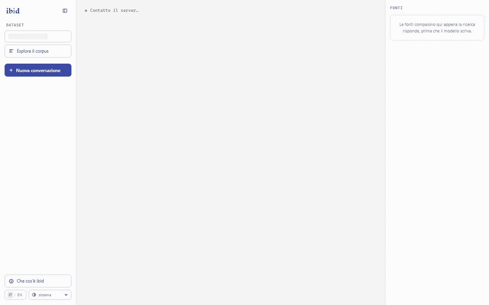
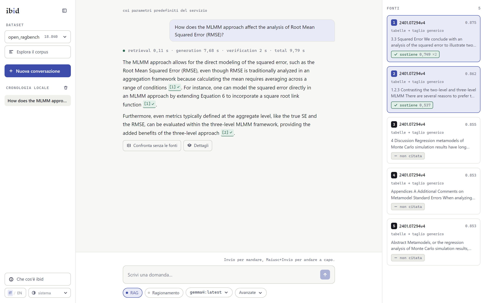
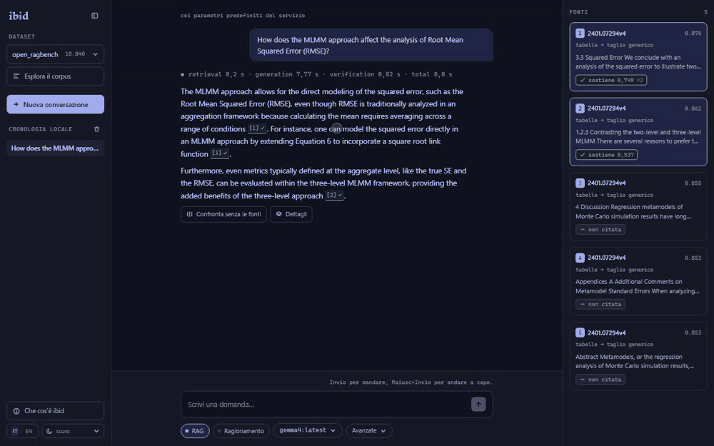

# ibid

**Banco di prova per RAG con citazioni verificate a livello di frase**, su modelli piccoli eseguiti in locale, valutato quantitativamente su dataset pubblici.

*[English version](README.en.md) 🇬🇧*

Ogni affermazione che il sistema produce porta un rimando al pezzo di documento da cui viene, e quel rimando viene **verificato**: un modello di entailment decide se il testo citato implica davvero la frase, invece di fidarsi di chi l'ha scritta. Il nome è l'abbreviazione che le note bibliografiche usano per rimandare alla fonte appena citata: dal latino *ibidem*, «nello stesso luogo».

Non è una demo con dei link in fondo alla risposta. È un banco di misura, costruito attorno a tre affermazioni: **due reggono, una è stata confutata dai numeri**. Quella confutata è rimasta in questa pagina, con la tabella che la smentisce, ed è il reperto più interessante del progetto.



<sub>Nessun taglio: gli **otto secondi di attesa sono quelli veri**, e la riga dei tempi sopra la risposta li scompone in recupero, generazione e verifica. Il seguito, con la fonte che si apre sul chunk citato, è in «Come funziona»: è lo stesso video, ritagliato in due.</sub>

---

## Avvio

Due comandi, per due bisogni diversi. Confonderli è ciò che rende un progetto difficile da provare.

### Vederlo funzionare

Serve **Docker**, e basta.

```bash
docker compose --profile demo up                 # costruisce e avvia (~30 s la prima volta)
```

Oppure, scaricando l'immagine pubblicata invece di costruirla:

```bash
IBID_IMAGE=ghcr.io/marco-pedretti/ibid:latest   docker compose --profile demo up --no-build --pull always
```

Le due strade arrivano allo stesso posto: la prima costruisce l'immagine qui, la seconda scarica quella pubblicata su `ghcr.io`. La differenza non è il tempo, è che la costruzione risolve le dipendenze dalla rete a ogni giro: l'immagine pubblicata sono i byte che sono stati provati.

Con `make` sono `make demo` e `make demo-pull`, che sono esattamente quelle due righe. Su Windows PowerShell la variabile va messa da parte, perché il prefisso è sintassi POSIX:

```powershell
$env:IBID_IMAGE = "ghcr.io/marco-pedretti/ibid:latest"
docker compose --profile demo up --no-build --pull always
```

L'interfaccia è su `http://localhost:8000`. Dentro c'è un **indice ridotto, committato nel repository**: 1.758 chunk ritagliati dai due corpus veri, con i vettori originali invece che ricalcolati. Niente corpus da scaricare, niente GPU: misurato, **17,9 secondi** dal comando alla pagina pronta.

Serve a **mostrare, non a riprodurre**, e l'interfaccia lo scrive mentre gira: i numeri di questa pagina vengono dall'indice completo, che è la sezione qui sotto. Per generare le risposte serve anche un modello (`LLM_BASE_URL`, sotto); senza, si sfoglia il corpus e il recupero risponde: cade solo la generazione.

### Toccare il codice, e rifare le misure

Servono **Docker** e un endpoint **OpenAI-compatibile** con un modello caricato: [Ollama](https://ollama.com) o `llama-server` di llama.cpp vanno bene entrambi. Il progetto non chiama mai un motore di inferenza direttamente: passa sempre da `LLM_BASE_URL`, ed è ciò che lo rende eseguibile su una macchina qualunque.

```bash
# 1. il modello, e le due manopole che valgono un fattore quattro sul prefill
ollama pull gemma4:latest
OLLAMA_CONTEXT_LENGTH=32768 OLLAMA_FLASH_ATTENTION=1 ollama serve

# 2. Qdrant e il backend
make up                  # docker compose --profile full up -d --build

# 3. i corpus (una tantum: ~2 ore di GPU per entrambi)
make fetch-datasets
make ingest

# 4. l'interfaccia
make dev                 # backend + frontend, su http://localhost:5173
```

Nessun indirizzo è cablato in `compose.yml`: per portare Qdrant o il modello su un'altra macchina basta l'ambiente, senza toccare il sorgente.

```bash
QDRANT_URL=http://10.0.0.5:6333 LLM_BASE_URL=http://10.0.0.7:11434/v1 make api
```

---

## Cosa dimostra

Tre affermazioni. Ognuna compare qui sotto con la propria tabella, **sempre per dataset e mai mediata fra i due**: sono generi documentali diversi, e una media aritmetica avrebbe nascosto il risultato principale del progetto.



<sub>Ogni citazione porta il proprio verdetto, e le fonti che il modello non ha citato restano in colonna marcate come tali invece di sparire.</sub>

### 1. L'attribuzione verificata è misurabile, e i modelli piccoli sbagliano in modo sistematico ✅

**Il formato si può imporre.** Il sistema accetta solo marcatori contigui `[n][m]`; le varianti note (`[1] [2]`, `[2, 3]`) le ripara un parser, e i marcatori che puntano a chunk non presenti in contesto vengono scartati dal codice, non dal modello.

| conformità di formato | grezza | dopo il parser | astensioni |
|---|---|---|---|
| `open_ragbench` | 0,9255 | **0,9628** | 6,0% |
| `ledger` | 0,9664 | **0,9732** | 25,5% |

<sub>200 domande per corpus, Gemma 4 E4B Q4_K_M, T=0, contesto 32k, dense <code>top_k</code> 5.</sub>

**La citazione, invece, si verifica.** L'unità è la coppia *(affermazione, chunk citato)*, più severa dell'unione delle citazioni di una frase, di proposito: un modello che affianca a una citazione giusta due irrilevanti sta facendo esattamente ciò che il progetto vuole scoprire.

| | `citation_precision` | Wilson 95% | `citation_recall` | `uncited_claim_rate` |
|---|---|---|---|---|
| `open_ragbench` | **0,6573** (326/496) | [0,6144 – 0,6977] | 0,6250 | 0,1062 |
| `ledger` (NLI) | 0,3656 (121/331) | [0,3155 – 0,4187] | 0,2815 | 0,1556 |
| `ledger` (numerico) | **0,7328** | n/d | copertura 39,6% | |

`uncited_claim_rate` sta accanto alla precisione perché **la precisione si alza citando di meno**: una citazione sicura e nient'altro farebbe 1,0. Il numero da solo non è leggibile.

Su `ledger` il verificatore NLI dà 0,3656 e quel numero **non descrive il generatore**: il 96,7% delle affermazioni sono valori estratti da tabelle OCR, e chiedere a un modello addestrato sulla prosa se `<table><tr><td rowspan="2">` implichi un numero non è un'inferenza linguistica. Da qui la seconda riga: `numeric_citation_precision` cerca la cella e confronta il valore. Le due metriche **non finiscono mai nella stessa colonna**: sono definizioni diverse, e fonderle renderebbe i due corpus non confrontabili.

**L'errore è sistematico, e dipende dal genere.** Su `open_ragbench` il **23% dei chunk contiene già marcatori `[n]`** (sono paper, e i paper citano così), e il modo dominante di sbagliare è copiare il sistema di riferimenti del documento invece del nostro. Su `ledger`, su 1.500 chunk campionati, i marcatori sono **zero**: quell'errore lì non può proprio esistere. Stesso modello, stesso prompt, stessa temperatura.

**E il grounding non aggiunge conoscenza: sopprime la confabulazione.** Su 35 domande costruite per non avere risposta nel corpus:

| domande non rispondibili | senza recupero | sistema completo |
|---|---|---|
| `open_ragbench` | 20,0% inventate | **0%** |
| `ledger` | 97,1% inventate | **0%** |

L'asimmetria fra 20% e 97% non è una proprietà dei corpus, è il tipo di domanda: davanti a una domanda finanziaria il modello sa di non poter consultare un bilancio e rifiuta; davanti a una domanda accademica risponde dalla memoria, e inventa. **Il guadagno è massimo esattamente dove il modello è più sicuro di sé.**

### 2. Il routing per genere batte la pipeline generica ❌ non sostenuta

Il progetto ha tre pipeline di chunking scritte a mano (`continuous_text`, `structured_hierarchical`, `table_heavy`) e un profilatore che assegna un genere a ogni documento e sceglie di conseguenza. L'ablation ha indicizzato entrambi i corpus due volte, una per strada, e ha confrontato le due sul golden set completo.

| `doc_R@5`, ricerca esatta | pipeline generica | pipeline instradata | divario |
|---|---|---|---|
| `open_ragbench` (3.045 query) | 0,9681 | 0,9787 | **+1,06** |
| `ledger` (10.000 query) | 0,8962 | 0,7590 | **−13,72** |

<sub>Test appaiato di McNemar sulle stesse query. Su <code>open_ragbench</code> il guadagno è reale ma marginale; su <code>ledger</code> la perdita è schiacciante (p &lt; 0,0001).</sub>

**Sul genere tabellare la pipeline scritta apposta per lui recupera peggio.** Non un po' peggio: quattordici punti. Il valore del routing dipende dal genere, e una media dei due numeri (circa −6) avrebbe nascosto sia il segno opposto sia il fatto che le due metà hanno forza statistica incomparabile.

Due cose vale la pena dire su come questo numero è stato ottenuto, perché sono metà del risultato:

- **Otto dei ventidue punti di regresso erano l'indice, non la pipeline.** Le due collection hanno densità molto diverse (47k contro 228k punti), e con una ricerca approssimata il confronto misura anche quanto richiamo l'indice perde per strada. In ricerca esatta il divario passa da −21,71 a −13,72. Confrontare due indici di densità diversa con una ricerca approssimata non è un confronto fra pipeline.
- **La causa del regresso resta aperta.** Le tre ipotesi iniziali sono cadute tutte; il protocollo e le misure stanno in [`docs/open-questions.md`](docs/open-questions.md), OQ-01.

Le collection instradate non sono state cancellate (sono il secondo braccio della misura, e senza di esse l'affermazione non sarebbe più confutabile), ma **non compaiono nell'interfaccia**: un menù che offre due strade dichiara da solo che sono alternative alla pari, e queste non lo sono.

### 3. Con un buon recupero la taglia del modello conta meno del previsto ✅ nella forma forte

Tre taglie della stessa famiglia, stesse 91 domande, stesso prompt, stesso contesto recuperato. Fra un punto e l'altro cambia **solo il modello**.

| | `format_compliance` | astensioni | latenza p50 | VRAM |
|---|---|---|---|---|
| Gemma 4 **E2B** (5,1B) | 0,8681 | 5 | 7,6 s | 1,93 GB |
| Gemma 4 **E4B** (8,0B) | **0,9670** | 5 | 9,4 s | 3,28 GB |
| Gemma 4 **12B** (11,9B) | **0,9670** | 9 | **19,2 s** | 8,1 GB |

Il salto c'è **una volta sola**: E2B → E4B vale +9,9 punti (9 query a 0, p = 0,0039). Poi la curva è piatta: E4B → 12B è **+0,0000**, una query per parte, p = 1,0000, **al doppio della latenza**. Non è «un guadagno piccolo»: è zero a quattro decimali.

Due limiti vanno letti accanto al risultato: la curva è misurata sulla **conformità di formato** (il terzo punto non ha il verificatore NLI) e **solo su `open_ragbench`** (su `ledger` E4B è già a 1,0000, e non c'è dove salire). Che, per l'affermazione, è un modo diverso di dire la stessa cosa.

---

## Il recupero, e la quarta volta che il genere decide

Otto configurazioni, due corpus, golden set completi, tutte in ricerca esatta.

| `open_ragbench` | nDCG@10 | Success@1 | R@5 | `doc_R@5` |
|---|---|---|---|---|
| dense | 0,7184 | 0,5448 | 0,8279 | 0,9681 |
| sparse (BM25) | 0,7855 | 0,6263 | 0,8837 | 0,9882 |
| hybrid (RRF) | 0,8004 | 0,6345 | **0,9044** | **0,9954** |
| dense + rerank | 0,7873 | 0,6548 | 0,8716 | 0,9829 |
| **hybrid + rerank** | **0,8053** | **0,6594** | 0,8939 | 0,9915 |

| `ledger` | nDCG@10 | Success@1 | R@5 | `doc_R@5` |
|---|---|---|---|---|
| dense | 0,2465 | 0,2647 | 0,2112 | 0,8962 |
| sparse (BM25) | 0,0272 | 0,0291 | 0,0214 | 0,8837 |
| hybrid (RRF) | 0,1564 | 0,0986 | 0,1287 | **0,9129** |
| **dense + rerank** | **0,2792** | **0,3110** | **0,2473** | 0,8911 |
| hybrid + rerank | 0,2570 | 0,3056 | 0,2274 | 0,9023 |

**La configurazione migliore dipende dal genere.** Su `open_ragbench` vince la fusione col rerank; su `ledger` vince il denso col rerank, e la fusione (che sull'altro corpus è la scelta più forte) è la peggiore delle due strade. Una riga sola non esiste.

Il reranker fa **una cosa sola e la fa sempre**: mettere il candidato giusto al primo posto, in tutti e quattro i confronti appaiati (da +3,8 a **+16,3** punti di Success@1, p < 0,0001). E dove non c'era margine può solo rimescolare: su `ledger`, dove il documento giusto era già fra i primi cinque nel 94% dei casi, `doc_R@5` **peggiora** in entrambe le modalità. Il prezzo sta scritto accanto al guadagno, non dentro una media.

---

## Come funziona

```
domanda → riscrittura → recupero ibrido (denso + BM25, fusione RRF)
        → rerank (cross-encoder) → gate di astensione (soglia derivata dai dati)
        → generazione con marcatori imposti → parser → verifica di entailment
        → risposta con citazioni cliccabili, ognuna risolta al suo chunk
```



<sub>Il seguito della ripresa qui sopra, dallo stesso video: la fonte si apre sul chunk che è stato citato, e la domanda fuori corpus chiude il gate in mezzo secondo, prima che il modello venga interrogato.</sub>

| | |
|---|---|
| **Backend** | Python 3.12, FastAPI, streaming SSE. Nessun framework RAG: la pipeline *è* il progetto |
| **Vector store** | Qdrant, named vectors: denso e sparso in una collection sola, una collection per dataset |
| **Embedding** | `intfloat/multilingual-e5-large` (1024-dim) via fastembed + ONNX Runtime |
| **Reranker** | `BAAI/bge-reranker-base`, cross-encoder multilingue |
| **Verifica** | `MoritzLaurer/bge-m3-zeroshot-v2.0`, scelto **dopo** averlo misurato contro mDeBERTa-v3: AUC 0,939 contro 0,661 su `open_ragbench` (p = 0,0001) |
| **Generazione** | Gemma 4 via endpoint OpenAI-compatibile, T=0, finestra 32k |
| **Frontend** | React + Vite + Tailwind, bilingue |
| **Dashboard** | Streamlit, separata dalla demo: serve a confrontare configurazioni e a guardare i fallimenti |

Due scelte hanno una ragione che vale la pena scrivere. Il **chunking è scritto a mano** per genere documentale, ~150 righe: i text splitter generici sono la causa numero uno di un recupero mediocre. E **tutti i parametri del recupero stanno in `config.py`**, così che un'ablation sia un ciclo sulla configurazione e non una modifica al codice.

Ogni risultato di valutazione è un JSON in `eval/results/` che registra `git_commit`, `config_hash`, `dataset_id`, modello, quantizzazione, finestra, temperatura e modalità: **una misura di cui non si sa in che condizioni è stata presa non è una misura.**

---

## I due corpus

Nessun corpus costruito a mano, nessuno scraping: solo dataset pubblici con licenza dichiarata e giudizi di rilevanza inclusi. I due appartengono a **generi documentali diversi**: è la condizione senza la quale l'affermazione 2 non sarebbe nemmeno formulabile.

| | `open_ragbench` | `ledger` |
|---|---|---|
| fonte | `vectara/open_ragbench` | `artefactory/ledger-long-context-KPI-QA` (CC-BY-4.0) |
| genere | paper accademici | bilanci societari, OCR con tabelle |
| documenti | 997 | 494 |
| chunk indicizzati | 18.840 | 47.110 |
| query golden | 3.045 + 35 non rispondibili | 10.000 + 35 non rispondibili |
| densità di tabelle | 0,103 | 0,410 |

Entrambi sono passati da un **controllo di contaminazione** prima di essere adottati: le domande sono state poste ai modelli *senza contesto*, e le risposte corrette esaminate una per una. Dettaglio in [`docs/contamination.md`](docs/contamination.md).

---

## Riprodurre una misura

```bash
# recupero: una configurazione, un corpus, mai i due insieme
python scripts/eval.py --retrieval-mode hybrid --rerank --dataset open_ragbench

# citazioni: genera, ripara, verifica, e salva ogni risposta col suo contesto
python scripts/eval_citations.py --dataset ledger --limit 200

# la linea di rumore: nessun miglioramento sotto σ può essere dichiarato tale
make noise-floor

# la dashboard, per confrontare due run
make dashboard
```

I comandi qui sopra presuppongono l'indice già costruito e i servizi accesi.
**[`docs/technical.md`](docs/technical.md) è il manuale**: prerequisiti,
installazione con un controllo per ogni passo, contratti, architettura, e la
procedura per riprodurre ognuna delle misure di questa pagina, comprese quelle
che non chiedono una GPU.

Le regole con cui questi numeri sono stati raccolti sono poche e vincolanti: **mai due modifiche dentro una misura sola**; nessuna metrica senza `dataset_id`; **nessun miglioramento dichiarato senza il confronto con la linea di rumore**; la soglia di astensione e il formato delle citazioni decisi nel codice, mai lasciati al modello.

- [`ROADMAP.md`](ROADMAP.md): le decisioni, i contratti dati, i task con i loro criteri
- [`docs/progress.md`](docs/progress.md): le misure, run per run, comprese quelle andate male
- [`docs/open-questions.md`](docs/open-questions.md): le domande aperte, col protocollo per chiuderle
- [`STACK.md`](STACK.md): le scelte tecniche e la tabella delle licenze

<sub>Sono in italiano, come i commenti nel codice: è il quaderno di lavoro del progetto, non la sua vetrina.</sub>

---

## Limiti, e i risultati negativi

I risultati negativi restano in tabella per contratto. Questi sono quelli che pesano.

- **Il routing non batte la pipeline generica** (affermazione 2), e sul genere tabellare la peggiora di quattordici punti. La causa non è stata trovata: tre ipotesi ragionevoli sono cadute tutte.
- **Su `ledger` la precisione di citazione non è misurabile con un verificatore NLI.** Rendere leggibili le tabelle OCR non ha aiutato (0,3656 → 0,3263, p = 0,1112): il verificatore è indifferente alla forma della tabella. La risposta è stata costruire un verificatore numerico per quel genere, con la sua copertura dichiarata (39,6%) invece che nascosta.
- **Il filtro sui metadati peggiora il recupero** sul corpus accademico (−4,1% di nDCG@10): i chunk rilevanti dei paper sono spesso misti, testo e tabelle insieme, e un filtro «solo testo» li esclude. Il flag resta, spento.
- **Chunk più lunghi non hanno comprato niente**: 618 minuti di re-ingestione e un indice quattro volte più grande per +0,0000 di conformità. Gli undici punti che sembravano il risultato erano la lunghezza della premessa, non la qualità delle citazioni.
- **Niente coordinate sulla pagina.** Nessuno dei due corpus distribuisce i PDF originali: `open_ragbench` è JSON pre-processato, `ledger` è Markdown OCR con le coordinate perse nella conversione. La citazione risolve al chunk, non al rettangolo sulla pagina.
- **Il `config_hash` nomina la configurazione, non lo stato dell'indice.** Due run con lo stesso nome possono aver interrogato indici diversi: è successo, e sta scritto.
- **Niente demo ospitata.** Verificato: senza una GPU gratuita il limite che morde è la quota di token, e una query RAG con cinque chunk ne consuma quattro o cinque mila, circa una domanda al minuto. Un link lento e a quota è peggio di nessun link.

## Cosa manca

Upload di documenti propri con isolamento per sessione; multi-turno (oggi ogni domanda è indipendente); recupero visivo in stile ColPali sul corpus tabellare; una prova di scala su qualche migliaio di documenti non annotati; la finestra di contesto scelta guardando l'hardware invece che fissata a 32k. In ordine di priorità in [`ROADMAP.md`](ROADMAP.md), §13.

---

## Licenza e attribuzioni

MIT, vedi [`LICENSE`](LICENSE). **Nessuna dipendenza copyleft entra nell'albero**, ed è un vincolo verificato a ogni aggiunta: la tabella delle licenze sta in [`STACK.md`](STACK.md).

Dataset: `vectara/open_ragbench`; `artefactory/ledger-long-context-KPI-QA` (CC-BY-4.0). Modelli: Gemma 4 (Google), `multilingual-e5-large` e `Qdrant/bm25` (Apache 2.0), `bge-reranker-base` e `bge-m3-zeroshot-v2.0` (MIT).

Progetto di **Marco Pedretti** ed **Elia Dallanoce**.
